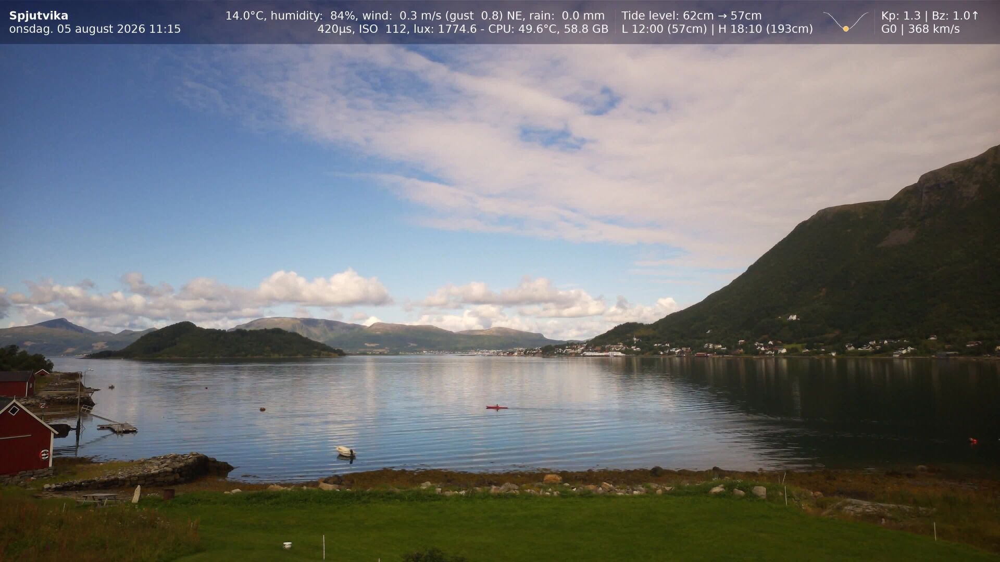
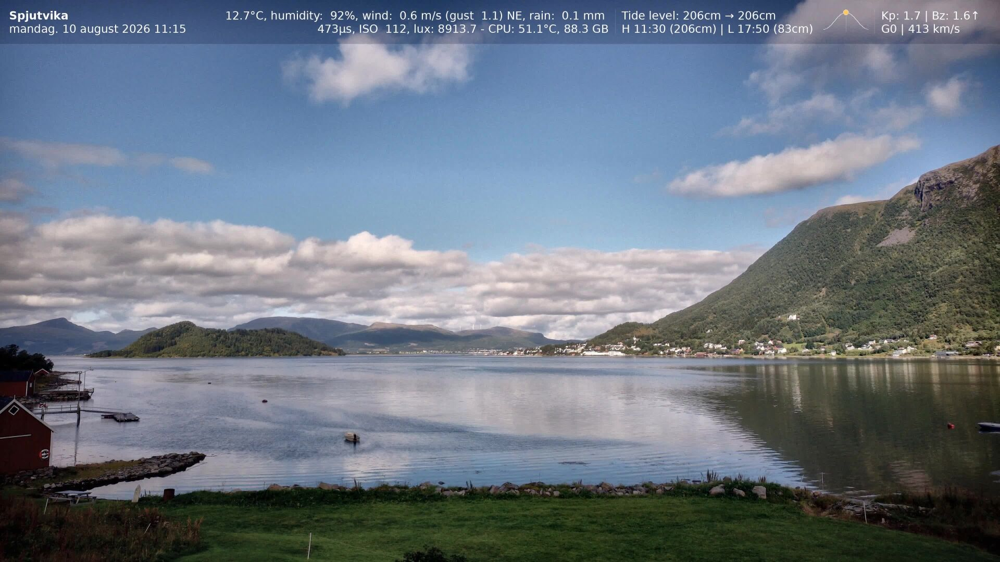

# Raspilapse: Automated Day-to-Night Timelapses for Raspberry Pi


[](https://codecov.io/gh/ekstremedia/raspilapse)


Continuous timelapse capture for the Raspberry Pi camera. Runs 24/7, adapts
exposure from daylight through twilight to 20-second night exposures without
flicker, burns an information overlay into each frame, and assembles a
deflickered, ready-to-publish video once a day, like the one below.

Built for a camera at 68°N, where "day" and "night" stop meaning what they
usually do, so the exposure works from the measured brightness of the previous
frame rather than from the clock, the calendar or the sun. There is nothing in
it to configure for your latitude.


*Day-to-night transition from a production camera in Spjutvika, Norway. Watch the exposure readout in the overlay: the adaptive ladder ramps smoothly from a 315 µs daylight shutter to 8.4-second night exposures, over four orders of magnitude, with no visible jump between frames.*

▶️ **[Watch the full timelapse on YouTube](https://youtu.be/AAI5toBP7wc?t=75)** (the link starts right at the sunset)

📷 **[See my cameras live on my website!](https://nesthus.no/public/cameras)**

### Exposure fusion

With `dynamic_range.method: fusion`, each daytime frame is captured as an exposure bracket and merged with Mertens-Kautz-Van Reeth exposure fusion: every pixel is weighted by how well-exposed it is in each bracket and blended through a multi-scale pyramid. There is no radiance map and no HDR look: the result reads as one well-graded photograph, with cloud and shadow detail a single exposure clips away. An optional tone-mapping pass (luminance-only CLAHE) adds shadow lift and local contrast without shifting colors. The bracket spread narrows smoothly to zero as exposures lengthen toward night, so the day-to-night transition above stays flicker-free by construction.

| Single exposure | Exposure fusion + tone mapping |
| --- | --- |
|  |  |

*Same scene on comparable overcast-bright days: the fused frame keeps the cloud structure and mountain-side detail that the single exposure flattens out. See [More dynamic range](#more-dynamic-range) below for how to turn this on.*

## Requirements

- Raspberry Pi with a CSI camera port
- Camera Module V2, V3 or HQ
- Raspberry Pi OS Bookworm or Trixie (Bullseye works; it ships Python 3.9)
- Roughly 6-8 GB of disk per day at 4K/30s, before cleanup

## Install

```bash
sudo apt update
sudo apt install -y python3-picamera2 python3-yaml ffmpeg

git clone https://github.com/ekstremedia/raspilapse.git
cd raspilapse
cp config/config.example.yml config/config.yml
nano config/config.yml     # at minimum: location, output.project_name, output.directory
```

That is the whole install — `python3-picamera2` brings numpy and Pillow with
it.

Optional, each for one feature, and each skippable — the feature degrades and
nothing else notices:

```bash
# Sun elevation, recorded alongside each frame. apt ships astral 1.6, whose
# API predates LocationInfo, so this is the one thing that needs pip.
pip3 install --break-system-packages 'astral>=3.2'

sudo apt install -y python3-requests python3-requests-toolbelt  # video upload
sudo apt install -y python3-matplotlib                          # scripts/db_graphs.py
```

Check everything is in place before installing any services:

```bash
./scripts/install.sh --check
```

Take one frame to confirm the camera works:

```bash
python3 -m raspilapse.cli.capture --test
```

Then install the systemd units:

```bash
./scripts/install.sh
sudo systemctl start raspilapse
```

That gives you four components — one service and three timers:

| Unit | What it does | When |
|------|--------------|------|
| `raspilapse.service` | Continuous capture | always |
| `raspilapse-daily-video.timer` | Yesterday's video, keogram, slitscan | 05:00 |
| `raspilapse-cleanup.timer` | Delete expired images, videos and database rows | 02:00 |
| `raspilapse-upload-retry.timer` | Retry failed uploads | every 30 min |

`systemctl list-timers 'raspilapse-*'` is the authority on the schedule; the
times above are a summary, and `list-timers` wins where they disagree.

Managing them:

```bash
sudo systemctl start|stop|restart raspilapse       # the capture service
systemctl status raspilapse
systemctl list-timers 'raspilapse-*'               # when each timer next fires

sudo systemctl start raspilapse-daily-video.service # run a batch job now
sudo systemctl start raspilapse-cleanup.service
```

The three batch units have no `[Install]` section, so they cannot be enabled
directly — their timers own the schedule. Enabling and disabling is
`./scripts/install.sh` and `--uninstall`.

Other installer options:

```bash
./scripts/install.sh --only capture,cleanup   # a subset
./scripts/install.sh --with-watchdog          # restart on stalled capture (runs as root)
./scripts/install.sh --with-netwatch          # recover a dropped network; can reboot (runs as root)
./scripts/install.sh --dry-run                # print the units, install nothing
./scripts/install.sh --uninstall
```

## Configuration

Copy `config/config.example.yml` to `config/config.yml`, which is gitignored
because it holds your API keys. The example is deliberately short, because
everything it leaves out has a default in `raspilapse/config.py`. Your config
only has to say what you want to change.

`docs/CONFIG-REFERENCE.yml` is the full schema, every setting annotated. A test
fails if it drifts from what the code actually reads, and another fails if the
code starts requiring something with no default.

The settings most worth understanding:

| Setting | Why it matters |
|---------|----------------|
| `location.latitude` / `longitude` | Recorded with each frame and plotted by the graph scripts. Nothing decides from it. |
| `output.directory` | Where frames land. Needs to exist and be writable. |
| `adaptive_timelapse.interval` | Seconds between frames. 30 is a good default. |
| `adaptive_timelapse.brightness_target.base` | What the exposure loop aims for, 0-255 (an overcast boost is added on top). Raise for brighter frames. |
| `adaptive_timelapse.night_mode.max_exposure_time` | The dark end of the ladder. 20s suits aurora; lower it if you want shorter nights. |
| `logging.level` | `INFO` while setting up, `WARNING` for 24/7. |

## How exposure works

One feedback loop and one ladder:

```text
required = current * (target / measured) ** damping
shutter  = min(required, ceiling)          # the shutter fills first
gain     = required / shutter              # gain covers what is left
```

A longer shutter costs time; more gain costs noise, so the order is forced.
That single rule replaced three modes selected by comparing an uncalibrated lux
figure against absolute thresholds, which had to be retuned per camera and per
site and were overridden at high latitude by sun elevation.

| Where on the ladder | Shutter | Gain |
|---------------------|---------|------|
| Bright | short, responds immediately | at its floor |
| Middle | lengthening | at its floor |
| Dark | at its ceiling | rising, and moving a fraction at a time |

`mode` survives as a label derived from the settings, for the overlay, the
database column and the graphs. Nothing decides from it.

White balance is manual in every condition — AWB drifting between frames is the
main cause of colour flicker in a timelapse — and cross-fades along the ladder
between a daylight white point and the configured night gains. The daylight end
is `day_mode.fixed_colour_gains` where that is set, and otherwise a reference
the camera learns for itself. An optional feedback loop (`day_mode.wb_feedback`)
trims that white point in small bounded steps toward whatever makes the
scene's grey pixels render grey, so daylight colour tracks the weather
without AWB's flicker; night and aurora colour are never touched.
Optional highlight protection lowers the brightness target when the top of the
histogram nears clipping, so bright skies keep detail.

Sun elevation is recorded with every frame if `astral` is installed, and is
plotted by `scripts/graph_solar_patterns.py`. Nothing decides from it either;
without astral the column is empty and the camera behaves identically.

See [docs/EXPOSURE.md](docs/EXPOSURE.md) for the details.

### More dynamic range

A single exposure cannot hold both a bright sky and dark ground, which is why
highlight protection exists at all. `adaptive_timelapse.dynamic_range` offers
four opt-in ways past that limit — `fusion` (exposure brackets merged at full
resolution, converging to the plain single shot at night), `tone_map` (gentle
CLAHE on the frame you already took), `sensor_hdr` (the Camera Module 3's
on-chip HDR, at reduced resolution) and `raw` (develop the sensor's DNG
on-Pi). Fusion and tone_map need `sudo apt install python3-opencv`; raw also
needs `python3-rawpy`. Compare them on your own scene with
`raspilapse-drtest`, and see the `dynamic_range` block in
[docs/CONFIG-REFERENCE.yml](docs/CONFIG-REFERENCE.yml) for the trade-offs.

## Usage

```bash
python3 -m raspilapse.cli.capture --test           # one frame, then exit
python3 -m raspilapse.cli.status                   # service state, config, recent captures
python3 -m raspilapse.cli.snapshot                 # single capture, no adaptive logic

python3 -m raspilapse.cli.timelapse                # video for the configured window
python3 -m raspilapse.cli.timelapse --start 07:00 --end 15:00 --today
python3 -m raspilapse.cli.daily --date 2026-07-25  # video + keogram + upload

python3 scripts/db_stats.py 24h                    # capture statistics
python3 scripts/db_graphs.py 7d                    # graphs into graphs/
python3 -m raspilapse.cli.db --stats               # database size and retention
python3 -m raspilapse.cli.db --prune --dry-run
```

The commands run from the project directory. `pip install -e .` additionally
puts them on `PATH` as `raspilapse-capture`, `raspilapse-status` and so on, but
it is not required — and on Raspberry Pi OS a virtualenv is usually the wrong
move, because `picamera2` comes from apt and a venv's own numpy will shadow the
one it was built against.

Logs are in `logs/<script>.log`. Under systemd the application log goes there
rather than to the journal, so lines are not stored twice; `journalctl -u
raspilapse` still shows systemd and libcamera output.

## Layout

Grouped by what each part talks to. Only `camera/` and `config.py` are needed
to take a photo; everything else is a feature you can leave uninstalled.

```text
raspilapse/
  config.py           configuration loading
  logging_setup.py    logging
  daemon.py           capture loop, scheduling, lifecycle
  camera/
    capture.py        Picamera2 wrapper
    exposure.py       the feedback loop and its state
    ladder.py         shutter/gain allocation
    metering.py       brightness measurement and the target
  overlay/
    render.py         burned-in overlay
    layout.py         text placement and measurement
    sources/          weather, ships, tide, aurora
  video/
    timelapse.py      ffmpeg video assembly
    keogram.py        keogram and slitscan
    daily.py          daily video + upload
    retention.py      video expiry
  storage/
    database.py       SQLite storage + maintenance
    upload.py         upload service and retry queue
  cli/                one module per console command
scripts/              install.sh, cleanup, watchdog, graph and stats tools
systemd/              unit templates, rendered by install.sh
config/               config.example.yml, a short starter file
```

## Documentation

| Document | Contents |
|----------|----------|
| [docs/INSTALL.md](docs/INSTALL.md) | Full installation walkthrough |
| [docs/CONFIG-REFERENCE.yml](docs/CONFIG-REFERENCE.yml) | Every setting, annotated |
| [docs/EXPOSURE.md](docs/EXPOSURE.md) | Exposure control and transitions |
| [docs/OVERLAY.md](docs/OVERLAY.md) | Overlay configuration |
| [docs/WEATHER.md](docs/WEATHER.md) | Weather data integration |
| [docs/TIMELAPSE_VIDEO.md](docs/TIMELAPSE_VIDEO.md) | Video, keogram, slitscan |
| [docs/TROUBLESHOOTING.md](docs/TROUBLESHOOTING.md) | When something is wrong, plus web serving and disk maths |
| [config/README.md](config/README.md) | Working with config files |
| [newcam.md](newcam.md) | Setting up a new camera Pi from scratch |
| [UpgradeOldRaspilapse.md](UpgradeOldRaspilapse.md) | Upgrading a pre-1.5.0 install |
| [CHANGELOG.md](CHANGELOG.md) | Version history |
| [CONTRIBUTING.md](CONTRIBUTING.md) | Development setup |
| [tests/replay/README.md](tests/replay/README.md) | How exposure changes are proved safe |

## Troubleshooting

```bash
./scripts/install.sh --check      # dependencies and config
python3 -m raspilapse.cli.status             # is it capturing?
tail -f logs/auto_timelapse.log   # what is it doing?
rpicam-still -o /tmp/test.jpg     # is the camera alive at all?
```

Camera not detected: check the ribbon cable, then `rpicam-still --list-cameras`
— Bookworm and later autodetect CSI cameras, so there is nothing to enable in
raspi-config.
Permission denied on the camera: `sudo usermod -aG video $USER`, then log out
and back in. Import errors for picamera2: install it with apt, never pip.

More in [docs/TROUBLESHOOTING.md](docs/TROUBLESHOOTING.md).

## License

MIT — see [LICENSE](LICENSE).

Copyright © 2024-2026 Terje Nesthus · [ekstremedia.no](https://ekstremedia.no)
